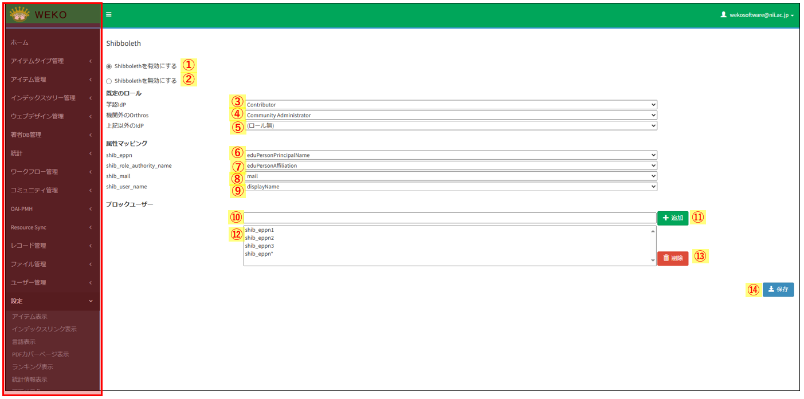
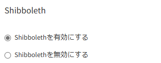
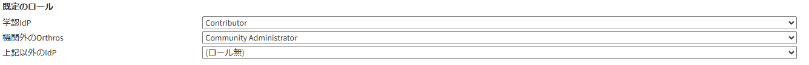
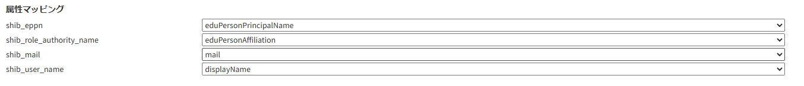
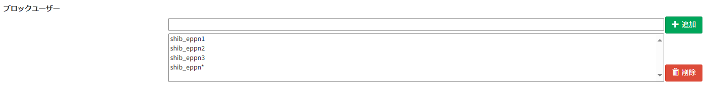

### Shibboleth

- > 目的・用途

  本画面の機能は以下の通りである。 

  ・[システム利用者がログインする際のシボレスユーザーの許可／拒否を設定](#シボレスユーザーの許可拒否を設定) 
  ・[システム利用者のデフォルトロールの設定](#デフォルトロールの設定) 
  ・[Shibboleth 属性と WEKO3 属性値のマッピング操作](#Shibboleth属性とWEKO3属性値のマッピング操作) 
  ・[ブロックユーザーの管理](#ブロックユーザーの管理)

- > 利用方法

  【Administration \> 設定（Setting） \> Shibboleth 画面】にて操作を行う。

- > 利用可能なロール

<table>
<thead>
<tr class="header">
<th>ロール</th>
<th>システム 
管理者</th>
<th>リポジトリ 
管理者</th>
<th>コミュニティ 
管理者</th>
<th>登録ユーザー</th>
<th>一般ユーザー</th>
<th>ゲスト 
(未ログイン)</th>
</tr>
</thead>
<tbody>
<tr class="odd">
<td>利用可否</td>
<td>○</td>
<td>○</td>
<td></td>
<td></td>
<td></td>
<td></td>
</tr>
</tbody>
</table>

- > 画面説明
  - 図 1 管理画面：Shibboleth 
    

<table>
<thead>
<tr class="header">
<th>No</th>
<th>項目名</th>
<th>表示</th>
<th>形式</th>
<th>I/O</th>
<th>データ取得元API</th>
<th>備考</th>
</tr>
</thead>
<tbody>
<tr class="odd">
<td>①</td>
<td>Shibboleth有効化</td>
<td>Shibbolethを有効にする</td>
<td>ラジオボタン</td>
<td>N/A</td>
<td></td>
<td>Shibboleth認証によるログインを有効化する。</td>
</tr>
<tr class="even">
<td>②</td>
<td>Shibboleth無効化</td>
<td>Shibbolethを無効にする</td>
<td>ラジオボタン</td>
<td>N/A</td>
<td></td>
<td>Shibboleth認証によるログインを無効化する。</td>
</tr>
<tr class="odd">
<td>③</td>
<td>学認IdP経由ログイン デフォルトロール設定</td>
<td>[ （ロール無）, System Administrator, Repository Administrator, Contributor, Community Administrator]</td>
<td>リストボックス</td>
<td>N/A</td>
<td></td>
<td>学認IdPでログインしてきたユーザーのデフォルトロールを設定する。 
デフォルトロールは「Contributor（登録ユーザー）」</td>
</tr>
<tr class="even">
<td>④</td>
<td>Orthros経由ログイン デフォルトロール設定</td>
<td>[ （ロール無）, System Administrator, Repository Administrator, Contributor, Community Administrator]</td>
<td>リストボックス</td>
<td>N/A</td>
<td></td>
<td>Orthros経由でログインしてきたユーザーのデフォルトロールを設定する。 
デフォルトロールは「Community Administrator（コミュニティ管理者）」</td>
</tr>
<tr class="odd">
<td>⑤</td>
<td>上記以外のIdP経由ログイン デフォルトロール設定</td>
<td>[ （ロール無）, System Administrator, Repository Administrator, Contributor, Community Administrator]</td>
<td>リストボックス</td>
<td>N/A</td>
<td></td>
<td>学認IdP、Orthros以外の方法でログインしてきたユーザーのデフォルトロールを設定する。
初期値は「ロール無（一般ユーザー）」</td>
</tr>
<tr class="even">
<td>⑥</td>
<td>shib_eppn 属性マッピング</td>
<td>['mail', 'sn', 'o', 'ou', 'givenName', 'displayName', 'eduPersonAffiliation', 'eduPersonPrincipalName', 'eduPersonEntitlement', 'eduPersonScopedAffiliation', 'eduPersonTargetedID', 'eduPersonAssurance', 'eduPersonUniqueId', 'eduPersonOrcid']</td>
<td>リストボックス</td>
<td>N/A</td>
<td></td>
<td>初期値は'eduPersonPrincipalName'</td>
</tr>
<tr class="odd">
<td>⑦</td>
<td>shib_role_authority_name 属性マッピング</td>
<td>['mail', 'sn', 'o', 'ou', 'givenName', 'displayName', 'eduPersonAffiliation', 'eduPersonPrincipalName', 'eduPersonEntitlement', 'eduPersonScopedAffiliation', 'eduPersonTargetedID', 'eduPersonAssurance', 'eduPersonUniqueId', 'eduPersonOrcid']</td>
<td>リストボックス</td>
<td>N/A</td>
<td></td>
<td>初期値は'eduPersonAffiliation'</td>
</tr>
<tr class="even">
<td>⑧</td>
<td>shib_mail 属性マッピング</td>
<td>['mail', 'sn', 'o', 'ou', 'givenName', 'displayName', 'eduPersonAffiliation', 'eduPersonPrincipalName', 'eduPersonEntitlement', 'eduPersonScopedAffiliation', 'eduPersonTargetedID', 'eduPersonAssurance', 'eduPersonUniqueId', 'eduPersonOrcid']</td>
<td>リストボックス</td>
<td>N/A</td>
<td></td>
<td>初期値は'mail'</td>
</tr>
<tr class="odd">
<td>⑨</td>
<td>shib_user_name 属性マッピング</td>
<td>['mail', 'sn', 'o', 'ou', 'givenName', 'displayName', 'eduPersonAffiliation', 'eduPersonPrincipalName', 'eduPersonEntitlement', 'eduPersonScopedAffiliation', 'eduPersonTargetedID', 'eduPersonAssurance', 'eduPersonUniqueId', 'eduPersonOrcid']</td>
<td>リストボックス</td>
<td>N/A</td>
<td></td>
<td>初期値は'displayName'</td>
</tr>
<tr class="even">
<td>⑩</td>
<td>ブロックユーザー ePPN入力欄</td>
<td></td>
<td>テキストボックス</td>
<td>N/A</td>
<td></td>
<td>アカウント作成前にブロックしたい新規ユーザーのePPNを入力する。 
ワイルドカードでの指定も可能。</td>
</tr>
<tr class="odd">
<td>⑪</td>
<td>ブロックユーザー 追加ボタン</td>
<td>追加</td>
<td>ボタン</td>
<td>N/A</td>
<td></td>
<td>⑩で入力したePPNをブロックユーザー一覧に登録する。</td>
</tr>
<tr class="even">
<td>⑫</td>
<td>登録済み ブロックユーザー一覧</td>
<td></td>
<td>リスト</td>
<td>N/A</td>
<td></td>
<td>登録済みのブロックユーザー一覧。</td>
</tr>
<tr class="odd">
<td>⑬</td>
<td>登録済み ブロックユーザー削除ボタン</td>
<td>削除</td>
<td>ボタン</td>
<td>N/A</td>
<td></td>
<td>⑫のリストから選択したユーザーを一覧から削除できる。</td>
</tr>
<tr class="even">
<td>⑭</td>
<td>保存ボタン</td>
<td>保存</td>
<td>ボタン</td>
<td>O</td>
<td></td>
<td>設定画面での変更内容を保存する。</td>
</tr>
</tbody>
</table>

<!-- end list -->

### シボレスユーザーの許可拒否を設定

- > 機能内容

  - 画面には以下のラジオボタンがあり、現在の許可/拒否設定を反映して表示される 

    図 2 
    

    - 「Shibboleth を有効にする」(Enable Shibboleth Authentication)

      - シボレスユーザーを許可とし、「Shibboleth User」ボタンをログイン画面に表示させる

    - 「Shibboleth を無効にする」（Disable Shibboleth Authentication）

      - シボレスユーザーを拒否とし、「Shibboleth User」ボタンをログイン画面に表示させない

  - ［保存（Save）］ボタンを押すと、設定内容を保存し、以下のメッセージを画面上部に表示する  
    JP：「Shibboleth 設定を更新しました」  
    EN：「Updated Shibboleth settings」

- > 関連モジュール

  - weko_accounts

- > 処理概要

  画面表示時に、weko_accounts.admin.ShibSettingView.index メソッドを GET で呼び出して、instance.cfg または weko-accounts で以下のコンフィグから Shibboleth の許可設定を読み込む。両方で設定されている場合、instance.cfg の設定が優先される。また、画面で設定を変更した場合は、その変更が最優先される。

  - パス（instance.cfg）：  
    <https://github.com/RCOSDP/weko/blob/v0.9.22/scripts/instance.cfg#L436>

  - パス（config.py）：  
    <https://github.com/RCOSDP/weko/blob/v0.9.22/modules/weko-accounts/weko_accounts/config.py#L29>

  - 設定キー：WEKO_ACCOUNTS_SHIB_LOGIN_ENABLED

  ［保存（Save）］ボタンを押すと、weko_accounts.admin.ShibSettingView.index メソッドを POST で呼び出して、以下のようにしてコンテキストに設定を保存する。

  > \_app = LocalProxy(lambda: current_app.extensions\['weko-admin'\].app)
  >
  > ※上記は ShibSettingView クラスの外で定義
  >
  > shib_flg = request.form.get('shibbolethRadios', '0')
  >
  > if shib_flg == '1':
  >
  > \_app.config\['WEKO_ACCOUNTS_SHIB_LOGIN_ENABLED'\] = True
  >
  > else:
  >
  > \_app.config\['WEKO_ACCOUNTS_SHIB_LOGIN_ENABLED'\] = False

### デフォルトロールの設定

- > 機能内容

  - [既定のロール]ではシステム利用者のデフォルトロールを設定することができる 

    図 3 
    

    - 候補として選択できるロールは以下の 5 種類

      - System Administrator(システム管理者)

      - Repository Administrator(リポジトリ管理者)

      - Community Administrator(コミュニティ管理者)

      - Contoributer(登録ユーザー)

      - ロール無(一般ユーザー)

  - > システム利用者は以下のように分類されており、それぞれのデフォルトロールを変更することができる

    - [学認 IdP]

      - 学認 IdP からログインしたシステム利用者のデフォルトロールを設定できる 
        初期値は「Contoributer(登録ユーザー)」

    - [機関外の Orthros]

      - 機関外の Orthros からログインしたシステム利用者のデフォルトロールを設定できる 
        初期値は「Community Administrator(コミュニティ管理者)」 
        ※[機関内の Orthros]からログインしたシステム利用者には「Repository Administrator(リポジトリ管理者)」が付与される。 
        [機関内の Orthros]は設定画面からは変更しない。

    - [上記以外の IdP]

      - 上記以外の IdP からログインしたシステム利用者のデフォルトロールを設定できる 
        初期値は「ロール無(一般ユーザー)」

    - ※(補足)「機関内外」の判定方法

      - 機関内外の判定は GakuNinmAP から取得できる[o]属性('organizationName')で判定する 
        取得した[o]属性が機関の'organizationName'と一致したら「機関内」と判定することができる

  - > 関連モジュール

    - weko_accounts

  - > 処理概要

    画面表示時に weko_accounts.admin.ShibSettingView.index メソッドを GET で呼び出して、weko-accounts で以下のコンフィグからデフォルトロール設定を読み込む。また、画面で設定を変更した場合は、その変更が最優先される。

    - パス（config.py）： (暫定)
      <https://github.com/RCOSDP/weko/blob/v0.9.22/modules/weko-accounts/weko_accounts/config.py#L110-L116>

    - 設定キー：WEKO_ACCOUNTS_GAKUNIN_ROLE, WEKO_ACCOUNTS_ORTHROS_INSIDE_ROLE,
      WEKO_ACCOUNTS_ORTHROS_OUTSIDE_ROLE, WEKO_ACCOUNTS_OTHERS_ROLE

      > ※ [学認 IdP]の処理のみ記載
      >
      > if current_app.config['WEKO_ACCOUNTS_GAKUNIN_ROLE']:
      >
      > gakunin_role = current_app.config['WEKO_ACCOUNTS_GAKUNIN_ROLE']

      選択肢の一覧はコンフィグから読み込んで HTML で生成する

    - パス（config.py）： (暫定)
      <https://github.com/RCOSDP/weko/blob/v0.9.22/modules/weko-accounts/weko_accounts/config.py#L121-L144>

    - 設定キー：WEKO_ACCOUNTS_ROLE_LIST

      > // admin.py
      >
      > role_list = current_app.config['WEKO_ACCOUNTS_ROLE_LIST']
      >
      > // shibuser.html
      >
      > const defaultRoleList = document.getElementById('default-role-list').getAttribute('data-value');
      >
      > const gakuninRoleList = document.getElementById('gakunin-role-list');
      >
      > gakuninRoleList.appendChild(createSelectList(0, 'role', gakuninRoleList.getAttribute('data-value')));
      >
      > ※ createSelectList()　選択肢を作成するメソッド

    ［保存（Save）］ボタンを押すと、weko_accounts.admin.ShibSettingView.index メソッドを POST で呼び出して、以下のようにしてコンテキストに設定を保存する。

    > ※ [学認 IdP]の処理のみ記載
    >
    > new_gakunin_role = request.form.get('roleLists0', '0')
    >
    > if gakunin_role != new_gakunin_role:
    >
    > gakunin_role = new_gakunin_role
    >
    > \_app.config['WEKO_ACCOUNTS_GAKUNIN_ROLE'] = new_gakunin_role
    >
    > flash(\_('Gakunin IdP role was updated.'), category='success')

### Shibboleth 属性と WEKO3 属性値のマッピング操作

- > 機能内容

  - > [属性マッピング]では WEKO3 属性のマッピングを行うことができる

    図 4 
    

    - 設定を行えるのは以下の 4 項目

      - shib_eppn

      - shib_role_authority_name

      - shib_mail

      - shib_user_name

  - > 関連モジュール

    - weko_accounts

  - > 処理概要

    画面表示時に、weko_accounts.admin.ShibSettingView.index メソッドを GET で呼び出して、weko-accounts で以下のコンフィグから WEKO3 属性のマッピング設定を読み込む。また、画面で設定を変更した場合は、その変更が最優先される。

    - パス（config.py）： (暫定)
      <https://github.com/RCOSDP/weko/blob/v0.9.22/modules/weko-accounts/weko_accounts/config.py#L77-L82>

    - 設定キー：WEKO_ACCOUNTS_ATTRIBUTE_MAP

      > if current_app.config['WEKO_ACCOUNTS_ATTRIBUTE_MAP']:
      >
      > weko_eppn_value = current_app.config['WEKO_ACCOUNTS_ATTRIBUTE_MAP']['shib_eppn']
      >
      > weko_role_authority_name_value = current_app.config['WEKO_ACCOUNTS_ATTRIBUTE_MAP']['shib_role_authority_name']
      >
      > weko_mail_value = current_app.config['WEKO_ACCOUNTS_ATTRIBUTE_MAP']['shib_mail']
      >
      > weko_user_name_value = current_app.config['WEKO_ACCOUNTS_ATTRIBUTE_MAP']['shib_user_name']

      選択肢の一覧はコンフィグから読み込んで HTML で生成する

    - パス（config.py）： (暫定)
      <https://github.com/RCOSDP/weko/blob/v0.9.22/modules/weko-accounts/weko_accounts/config.py#L85-L100>

    - 設定キー：WEKO_ACCOUNTS_ATTRIBUTE_LIST

      > // admin.py
      >
      > role_list = current_app.config['WEKO_ACCOUNTS_ATTRIBUTE_LIST']
      >
      > // shibuser.html
      >
      > const defaultAttrList = document.getElementById('default-attr-list').getAttribute('data-value');
      >
      > const eppnAttrList = document.getElementById('eppn-attr-list');
      >
      > eppnAttrList.appendChild(createSelectList(0, 'attr', eppnAttrList.getAttribute('data-value')));
      >
      > ※ createSelectList()　選択肢を作成するメソッド(デフォルトロール選択肢作成と同一)

    ［保存（Save）］ボタンを押すと、weko_accounts.admin.ShibSettingView.index メソッドを POST で呼び出して、以下のようにしてコンテキストに設定を保存する。

    > ※ ［shib_eppn］ 部分の処理のみ記載
    >
    > if weko_eppn_value != new_weko_eppn_value:
    >
    > weko_eppn_value = new_weko_eppn_value
    >
    > with current_app.app_context():
    >
    > current_app.config['WEKO_ACCOUNTS_ATTRIBUTE_MAP']['shib_eppn'] =
    >
    > new_weko_eppn_value
    >
    > flash(\_('shib_eppn mapping was updated.'), category='success')

### ブロックユーザーの管理

- > 機能内容

  - [ブロックユーザー]ではあらかじめログインをブロックしたいシステム利用者の ePPN を登録しておくことができる

    図 5 
    

  - システム利用者が WEKO3 アカウントを未所持の場合、アカウント作成前にブロックすることができる

  - ePPN はワイルドカードでの指定も可能で、特定の機関からのシステム利用者を丸ごとブロックすることも可能
    - ワイルドカードに指定された機関の中にすでに WEKO3 アカウントの所持者の ePPN が含まれていた場合でもログインブロックの対象として登録可能 
  - WEKO3 のアカウント所持者をブロックする場合、［保存（Save）］ボタンを押した際にアラートを表示した上でブロックの一覧に追加する

- > 関連モジュール

  - weko_accounts

- > 処理概要

  - ブロックユーザーの ePPN 管理は admin_settings テーブルで行う 
    ※ 初回のみ、テーブルにレコードを追加する手順が必要となる

    > ※ レコードの中身は以下
    >
    > id: \*\*(連番) 
    > name: blocked_user_settings 
    > settings: {"blocked_ePPNs": []}
    >
    > ※ populate-instance.sh の create-admin-settings-begin 付近に以下文を追加する
    >
    > ${INVENIO_WEB_INSTANCE} admin_settings create_settings \
    > 6 "blocked_user_settings" \
    > "{'blocked_ePPNs': []}"

  - システム管理者、およびリポジトリ管理者はブロックしたいユーザーの ePPN を settings.blocked_ePPNs に追加する 

    - ユーザー操作 
      [ブロックユーザー]の上部テキストボックスに ePPN を入力し、[追加]ボタンを押下する 
      下部リストに入力した ePPN が追加された後、最下部の[保存]ボタンを押下することでテーブルに追加される

  - ［保存（Save）］ボタンを押すと、weko_accounts.admin.ShibSettingView.index メソッドを POST で呼び出して、以下のようにしてテーブルを更新する。

  > new_block_user_list = request.form.get('block-eppn-option-list', '0')
  >
  > if block_user_list != new_block_user_list:
  >
  > new_eppn_list = json.loads(new_block_user_list)
  >
  > new_eppn_list.sort()
  >
  > updateSettings = {'blocked_ePPNs': new_eppn_list}
  >
  > AdminSettings.update('blocked_user_settings', updateSettings)
  >
  > flash(\_('Blocked user list was updated.'), category='success')
  >
  > block_user_list = json.dumps(new_eppn_list)

<!-- end list -->

- > 更新履歴

<table>
<thead>
<tr class="header">
<th>日付</th>
<th>GitHubコミットID</th>
<th>更新内容</th>
</tr>
</thead>
<tbody>
<tr class="odd">
<td><blockquote>

2023/08/31

</blockquote></td>
<td>353ba1deb094af5056a58bb40f07596b8e95a562</td>
<td>初版作成</td>
</tr>
<tr class="even">
<td><blockquote>

2025/02/-

</blockquote></td>
<td></td>
<td>Shibboleth 管理画面を追加</td>
</tr>
</tbody>
</table>
